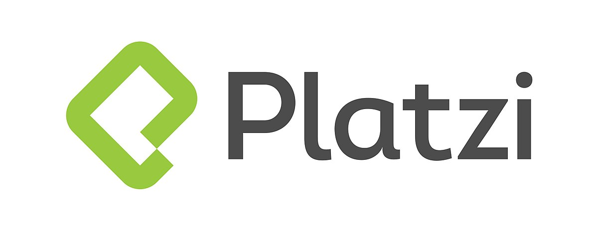

# Python Programmer

Welcome to this basic Python repository! Python is a popular, high-level programming language known for its simplicity, readability, and flexibility. It is a great language for beginners to learn and can be used for a wide range of applications, including web development, data analysis, and scientific computing.

This repository contains a collection of basic Python examples and exercises. Whether you are a complete beginner or have some programming experience, you will find something here to learn and practice.